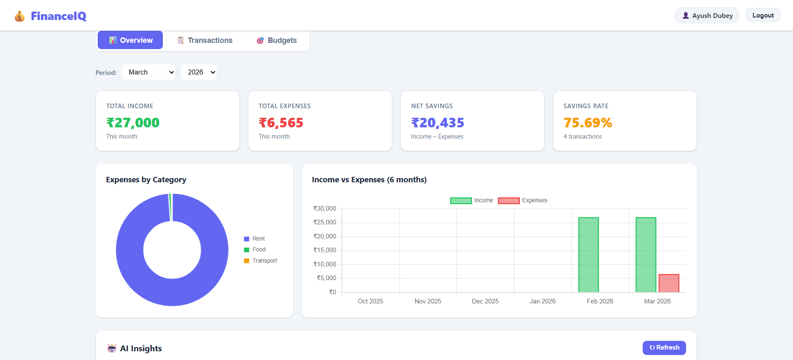
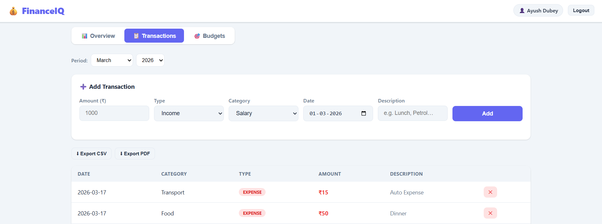
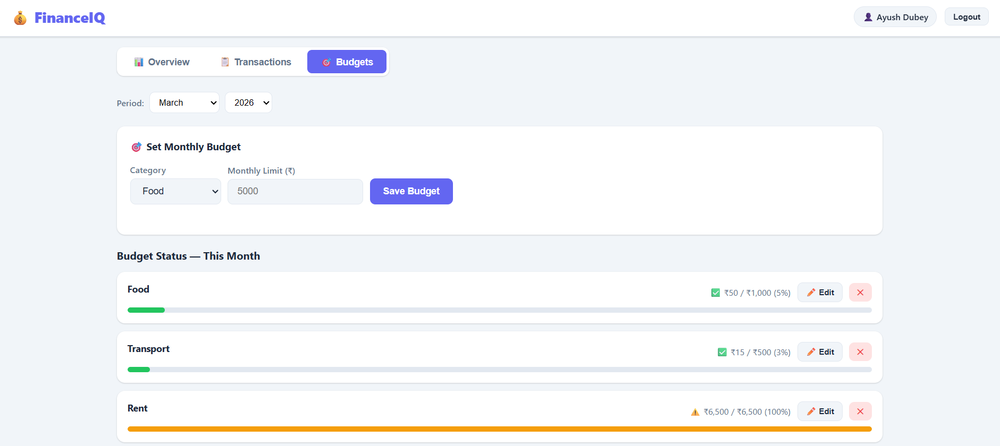
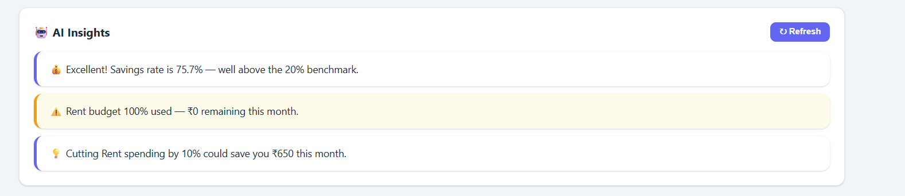

# 💰 FinanceIQ — Personal Finance Dashboard

> A full-stack personal finance management system with an AI-powered spending analysis engine, interactive dashboards, and exportable reports.


---

## 📸 Screenshots

> Dashboard Overview · Transactions · Budget Tracking · AI Insights

<!-- Add screenshots here after deployment -->
<!--  -->



---

## ✨ Features

- 🔐 **JWT Authentication** — Stateless login/register with BCrypt password hashing
- 📊 **Interactive Dashboard** — Real-time income, expenses, savings rate and transaction count
- 📈 **Visual Analytics** — Doughnut chart (expenses by category) and bar chart (6-month income vs expenses trend)
- 🤖 **AI Insight Engine** — 6-layer rule-based spending analysis engine that detects anomalies, budget violations, savings rate drops and more
- 🎯 **Budget Tracking** — Set monthly limits per category with live progress bars, edit and delete support
- 📋 **Transaction Management** — Add, view, filter by month/year, and delete transactions
- 📄 **Report Export** — Download monthly reports as **CSV** or styled **PDF**
- 🔒 **Data Isolation** — Every user can only access their own data

---

## 🤖 AI Insight Engine

The insight engine runs 6 analysis rules against the user's real transaction history:

| Rule | Analysis | Trigger |
|------|-----------|---------|
| 1 | Month-over-month spending change | > 15% rise triggers warning |
| 2 | Savings rate analysis | < 10% triggers alert, > 30% praised |
| 3 | Budget violation detection | > 100% triggers alert, > 80% warns |
| 4 | 3-month category anomaly detection | > 50% above rolling average |
| 5 | Smart reduction suggestion | Biggest category × 10% saving tip |
| 6 | Data completeness check | No income recorded warning |

---

## 🛠 Tech Stack

### Backend
| Technology | Purpose |
|-----------|---------|
| Java 24 | Core language |
| Spring Boot 4.0.3 | Application framework |
| Spring Security | Authentication & authorization |
| Spring Data JPA | Database ORM layer |
| Hibernate 7 | JPA implementation |
| MySQL 8 | Relational database |
| jjwt 0.12.6 | JWT token generation & validation |
| OpenCSV 5.8 | CSV report generation |
| OpenPDF 1.3.30 | PDF report generation |
| Lombok | Boilerplate reduction |

### Frontend
| Technology | Purpose |
|-----------|---------|
| HTML / CSS / Vanilla JS | Single page application |
| Chart.js 4.4 | Interactive charts |

### Testing
| Technology | Purpose |
|-----------|---------|
| JUnit 5 | Unit testing framework |
| Mockito | Mocking dependencies |

---

## 🏗 Architecture

```
Browser (SPA — index.html)
        │
        │  REST API (JSON over HTTP)
        ▼
┌─────────────────────────────────┐
│         Spring Boot             │
│                                 │
│  Controllers (8 REST endpoints) │
│         │                       │
│  Services (Business Logic)      │
│    ├── AuthService              │
│    ├── TransactionService       │
│    ├── AnalyticsService         │
│    ├── BudgetService            │
│    ├── InsightService (AI)      │
│    └── ReportService            │
│         │                       │
│  Repositories (Spring Data JPA) │
│         │                       │
│  Security (JWT Filter)          │
└─────────────────────────────────┘
        │
        ▼
     MySQL
```

---

## 📁 Project Structure

```
src/main/java/com/finance/
├── FinanceDashboardApplication.java
├── config/
│   └── DataInitializer.java        # Seeds 12 default categories on startup
├── controller/                     # 8 REST controllers
├── dto/                            # 11 request/response DTOs
├── exception/
│   └── GlobalExceptionHandler.java
├── model/
│   ├── enums/
│   └── (5 JPA entities)
├── repository/                     # 5 Spring Data JPA repositories
├── security/                       # JWT filter, config, UserDetailsService
└── service/                        # 6 business logic services

src/main/resources/
├── application.properties.example  # Template — copy and fill in your values
└── static/
    └── index.html                  # Complete SPA frontend
```

---

## 🚀 Getting Started

### Prerequisites

- Java 24+
- Maven 3.9+
- MySQL 8.0+

### 1 — Clone the repository

```bash
git clone https://github.com/dubeyayushh/finance-dashboard.git
cd finance-dashboard
```

### 2 — Create the database

```sql
CREATE DATABASE finance_db;
```

### 3 — Configure application properties

```bash
cp src/main/resources/application.properties.example \
   src/main/resources/application.properties
```

Open `application.properties` and fill in your values:

```properties
spring.datasource.password=YOUR_MYSQL_PASSWORD

# Generate a secure secret:
# PowerShell: [Convert]::ToBase64String([System.Text.Encoding]::UTF8.GetBytes("your-random-32-char-string"))
jwt.secret=YOUR_BASE64_SECRET
```

### 4 — Run the application

```bash
mvn clean spring-boot:run
```

### 5 — Open the dashboard

```
http://localhost:8080
```

Register a new account and start tracking your finances.

---

## 📡 API Reference

### Authentication
```
POST   /api/auth/register     Register new user
POST   /api/auth/login        Login and receive JWT token
```

### Transactions
```
POST   /api/transactions               Add transaction
GET    /api/transactions?month=&year=  Get by month
DELETE /api/transactions/{id}          Delete transaction
```

### Dashboard & Analytics
```
GET    /api/dashboard/summary?month=&year=       Summary cards
GET    /api/analytics/categories?month=&year=    Category breakdown
GET    /api/analytics/monthly?months=            Monthly trends
```

### Budgets
```
POST   /api/budgets                    Set/update budget
GET    /api/budgets/status?month=&year= Budget status
DELETE /api/budgets/{id}               Delete budget
```

### Insights
```
GET    /api/insights           Get saved insights
POST   /api/insights/refresh   Re-run AI analysis
```

### Reports
```
GET    /api/reports/csv?month=&year=   Download CSV
GET    /api/reports/pdf?month=&year=   Download PDF
```

> All endpoints except `/api/auth/**` require `Authorization: Bearer <token>` header.

---

## 🧪 Running Tests

```bash
mvn test
```

Test coverage includes:
- `TransactionServiceTest` — add, delete, unauthorized access
- `AnalyticsServiceTest` — summary calculations, edge cases
- `InsightServiceTest` — insight generation, empty state

---

## 🔐 Security

- Passwords hashed with **BCrypt** (cost factor 10)
- Stateless authentication via **JWT tokens** (24h expiry)
- Every API call validates token via `JwtFilter`
- Users can only access **their own data** — enforced at service layer
- CSRF disabled (not needed for stateless JWT APIs)

---

## 📝 License

This project is licensed under the MIT License.

---

## 👤 Author

**Ayush Dubey**  
[GitHub](https://github.com/dubeyayushh)

---

> ⭐ If you found this project useful, consider giving it a star!